# Swashbuckler Diary

English | [简体中文](./README.md)

"Swashbuckler Diary" is an open source, cross platform local diary application. Half a lifetime of wind and rain, half a lifetime of travel, one's Jianghu, always needs to leave something to be wonderful.

Everyone has a swashbuckler in their heart, like a shadow following the wind, accompanying you to see the scenery all the way and remembering all your wonderful moments.

## Download Channels
- 
- [GitHub Releases](https://github.com/Yu-Core/SwashbucklerDiary/releases)
- [蓝奏云](https://wwfc.lanzouj.com/b04q15i4j) ( Password: 1234 )
- [百度手机助手](https://shouji.baidu.com/detail/5000042660?source=appbaidu)
- [豌豆荚](https://www.wandoujia.com/apps/8369224)
- [酷安](https://www.coolapk.com/apk/937401)

## Characteristics
- Minimalist style
- Tags, weather, mood, location
- Markdown
- Multilingual
- Dark mode
- Page adaptation (Multiple device sizes)
- All data is stored locally without the need for networking
- Local backup
- Webdav backup
- Export
- Sharing
- Achievements
- Logs

## Screenshot

 <table>
    <tr>
        <td>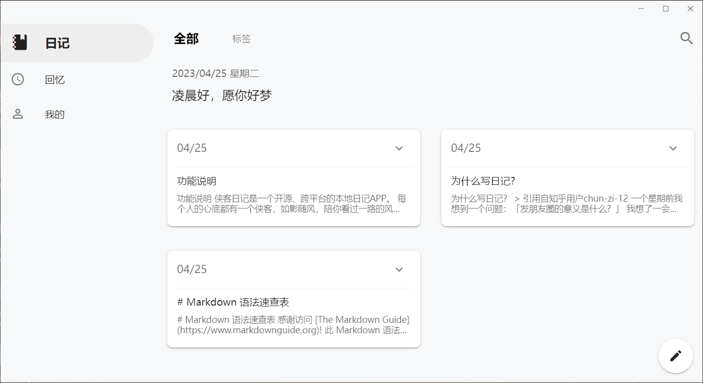</td>
        <td>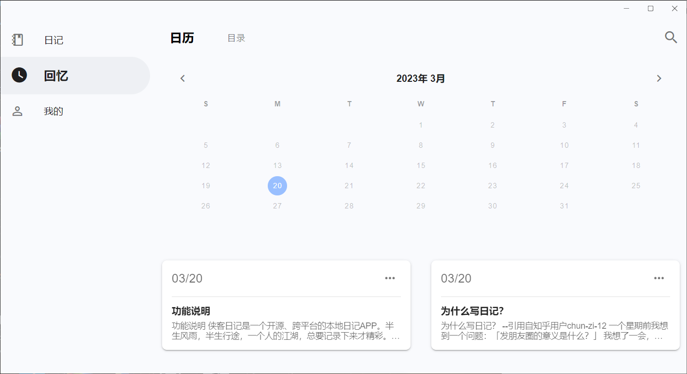</td>
        <td>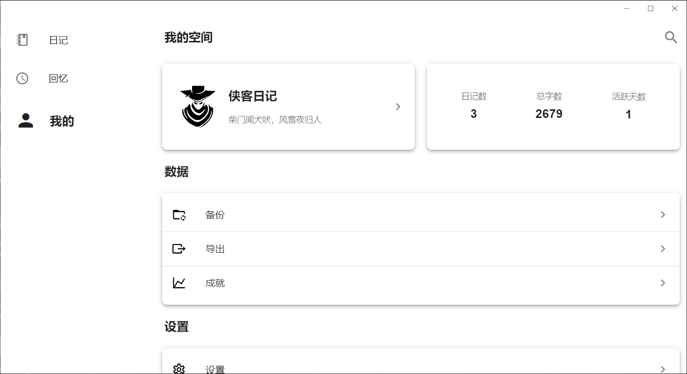</td>
    </tr>
    <tr>
        <td>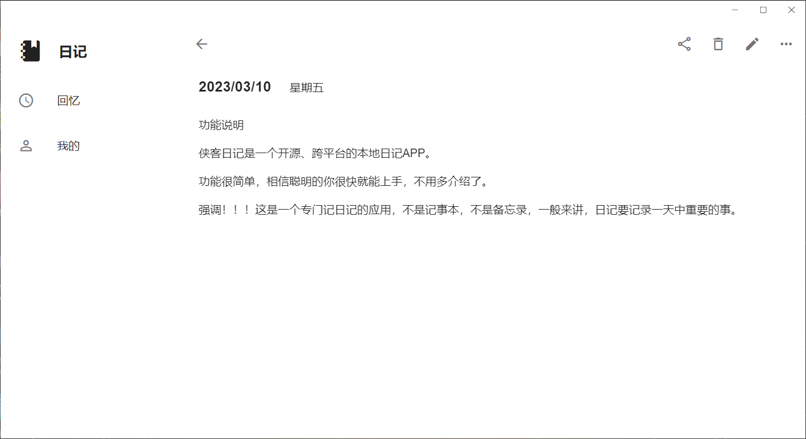</td>
        <td>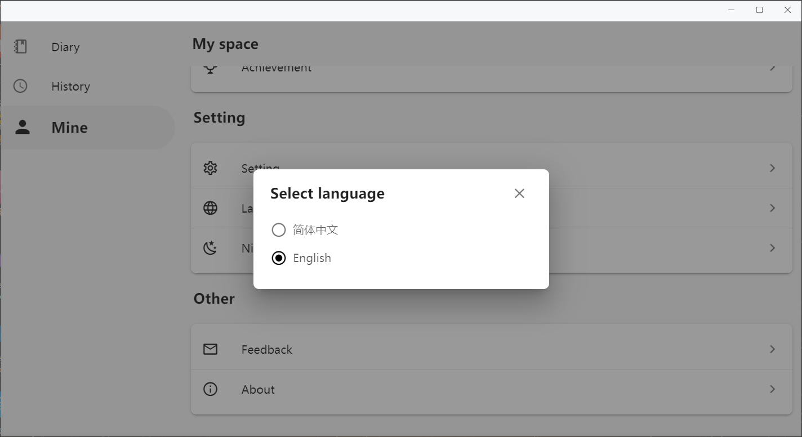</td>
        <td>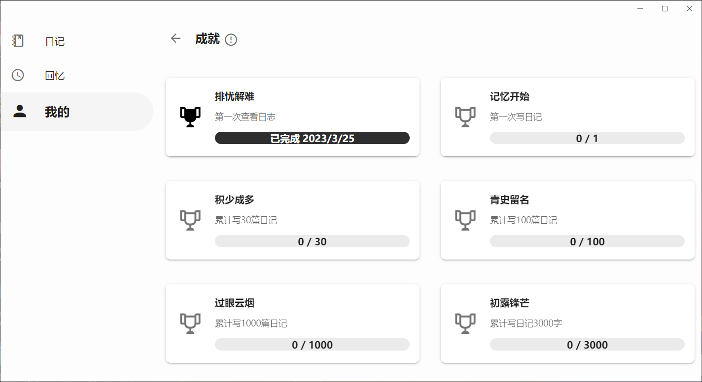</td>
    </tr>
    <tr>
        <td>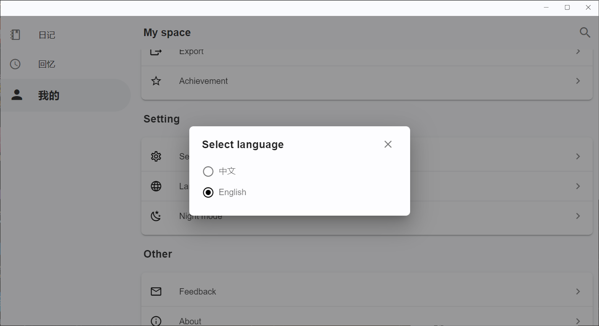</td>
        <td>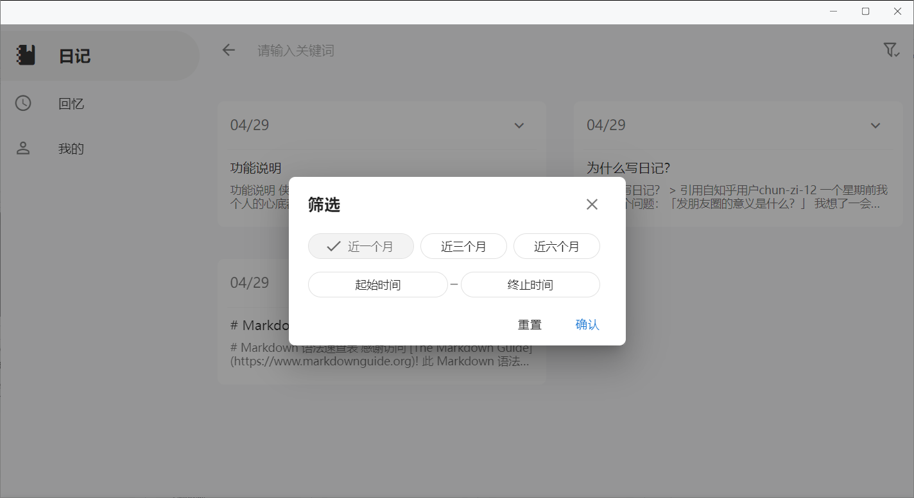</td>
    </tr>
 </table>

  <table>
    <tr>
        <td></td>
        <td>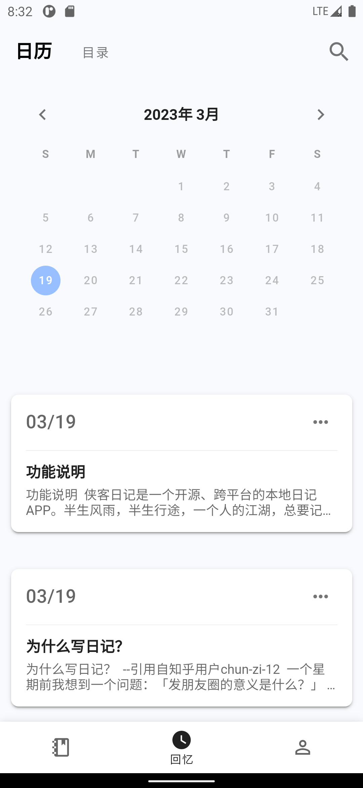</td>
        <td>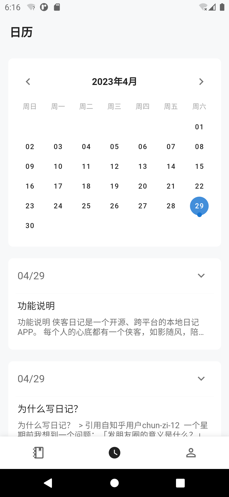</td>
        <td>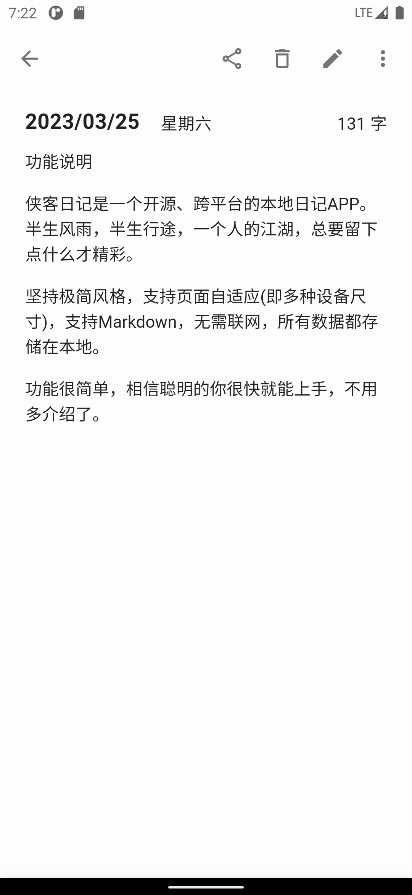</td>
    </tr>
    <tr>
        <td>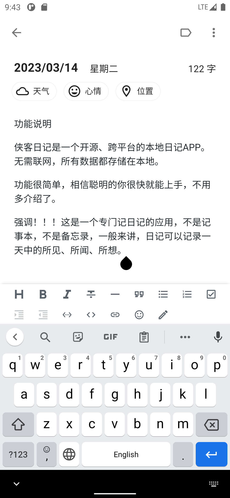</td>
        <td>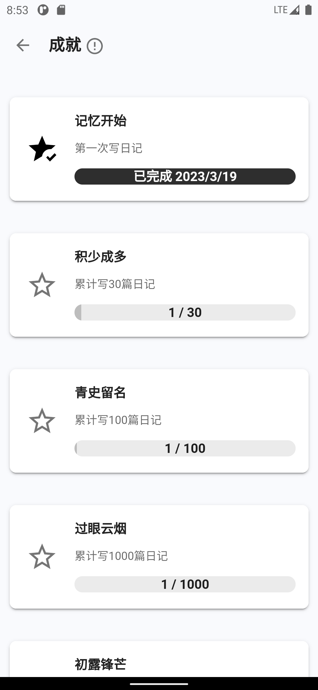</td>
        <td>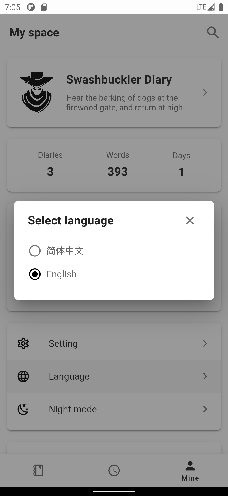</td>
        <td>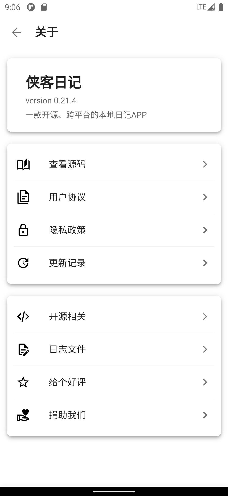</td>
    </tr>
 </table>

 ## Development Environment

[Visual Studio 2022](https://learn.microsoft.com/en-us/visualstudio/install/install-visual-studio?view=vs-2022) 或 [Visual Studio 2022 for Mac](https://learn.microsoft.com/en-us/visualstudio/mac/installation?view=vsmac-2022)

- System requirements

    - Windows 10 version 1909 or higher: Home, Professional, Education, and Enterprise
    - macOS Monterey 12.0 or higher

- Workload

    - Web and Cloud
        - ASP.NET and Web Development
    - Desktop and mobile apps
        - Mobile development using .NET / .NET Multi platform App UI development
        - .NET Desktop Development

## Supported Platforms
- Windows (Windows 11 and Windows 10 version 1809 or higher)
- Android (Android 7.0 (API 24) or higher)
- iOS (iOS 14 or higher)
- macOS (macOS 11 or higher)
- ~~Tizen (Not supported temporarily)~~

## Thanks to the following Open Source Projects
- [.NET MAUI](https://github.com/dotnet/maui)
- [ASP.NET Core](https://github.com/dotnet/aspnetcore)
- [CommunityToolkit.Maui](https://github.com/CommunityToolkit/Maui)
- [html2canvas](https://github.com/niklasvh/html2canvas)
- [Markdown Guide](https://github.com/mattcone/markdown-guide)
- [MASA.Blazor](https://github.com/BlazorComponent/MASA.Blazor)
- [MauiBlazorToolkit](https://github.com/Yu-Core/MauiBlazorToolkit)
- [Serilog](https://github.com/serilog/serilog)
- [Serilog.Sinks.SQLite.Maui](https://github.com/Yu-Core/Serilog-Sinks-SQLite-Maui)
- [SQLite-net](https://github.com/praeclarum/sqlite-net)
- [SqlSugar](https://github.com/DotNetNext/SqlSugar)
- [Swiper](https://github.com/nolimits4web/swiper)
- [WebDavClient](https://github.com/skazantsev/WebDavClient)
- [Vditor](https://github.com/Vanessa219/vditor)
