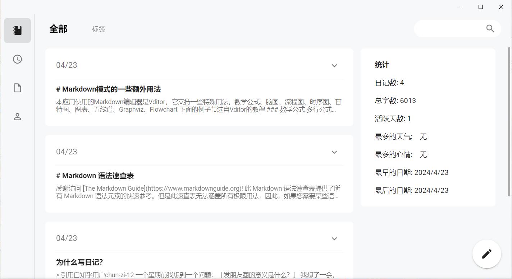
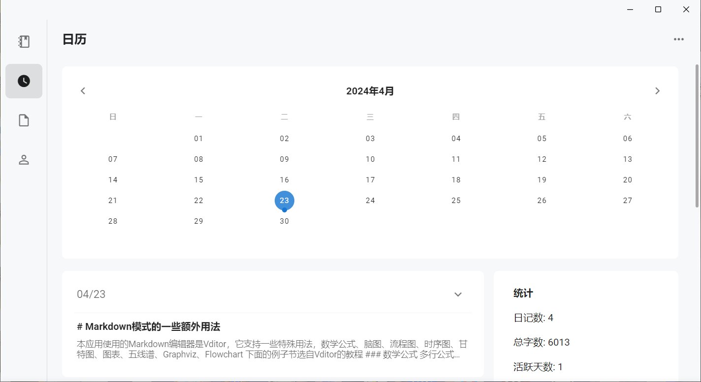
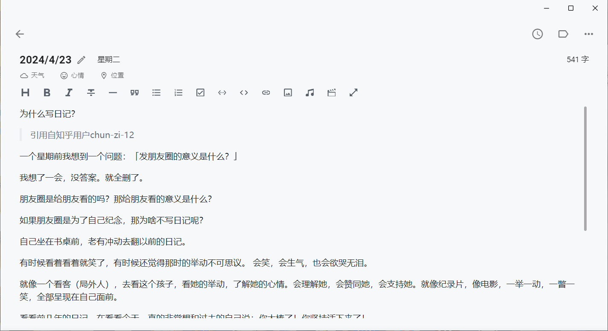
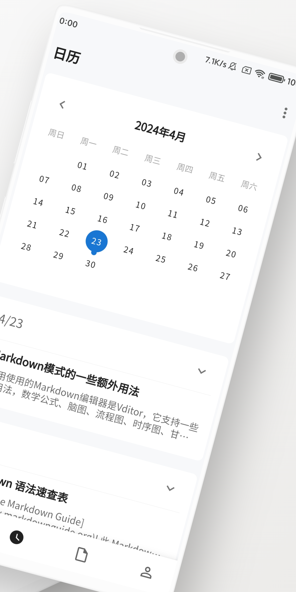
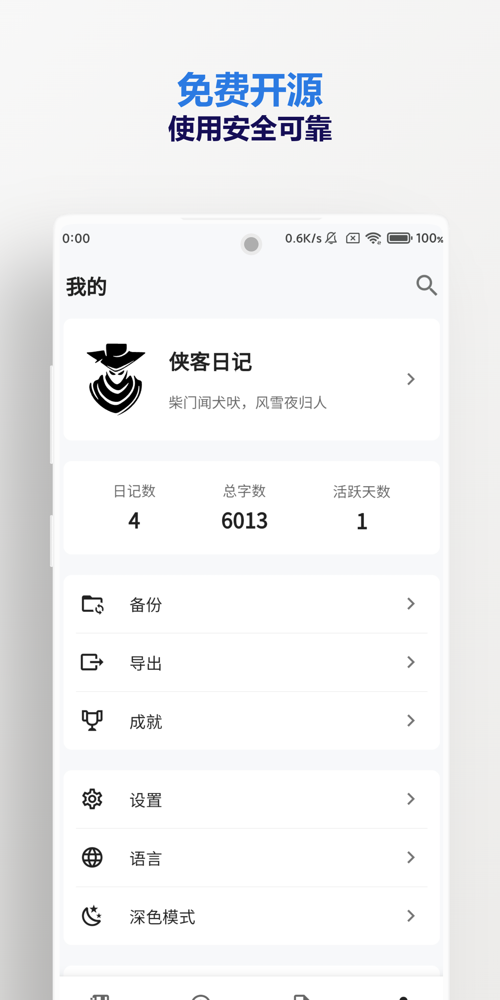
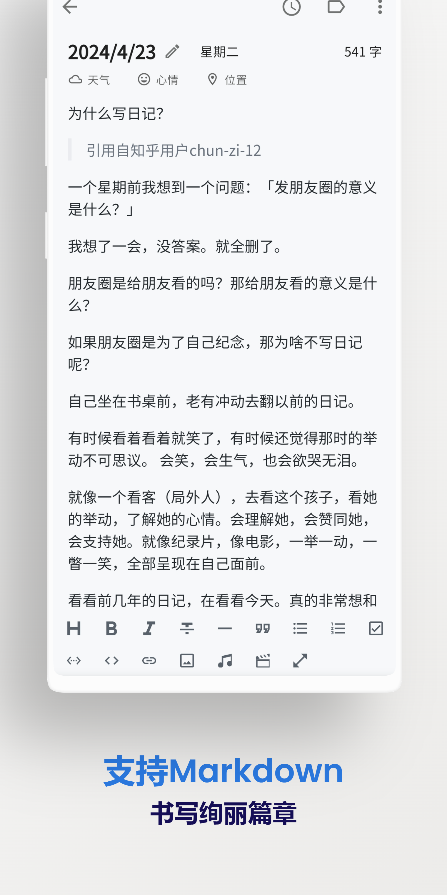

<h1 align="center">侠客日记</h1>

[English](./README.en-US.md) | 简体中文

「 侠客日记 」是一个开源、跨平台的本地日记APP。

不是所有日记都叫流水账，这本是侠客的秘籍！记录生活点滴，书写你的江湖传说。

## 🌏️ 在线预览
[在线演示地址（GitHub Pages）](https://yu-core.github.io/SwashbucklerDiary/)

## 🛠️ 主要技术栈
- [Blazor Hybrid](https://learn.microsoft.com/aspnet/core/blazor/hybrid/) 
- [Blazor WebAssembly](https://learn.microsoft.com/aspnet/core/blazor/hosting-models#blazor-webassembly)
- [Gir.Core](https://gircore.github.io/)
- [Masa Blazor](https://docs.masastack.com/blazor/introduction/why-masa-blazor) 
- [MAUI](https://learn.microsoft.com/dotnet/maui/)
- [Serilog](https://serilog.net/)
- [SqlSugar](https://www.donet5.com/Home/Doc) 
- [Vditor](https://b3log.org/vditor/) 

## 🚀 下载渠道
- 
- [GitHub 发行版](https://github.com/Yu-Core/SwashbucklerDiary/releases)
- [123云盘](https://www.123912.com/s/eVjxjv-IfnX)
- [百度手机助手](https://shouji.baidu.com/detail/5000042660?source=appbaidu)
- [豌豆荚](https://www.wandoujia.com/apps/8369224)
- [酷安](https://www.coolapk.com/apk/937401)
- [应用宝](https://sj.qq.com/appdetail/com.yucore.swashbucklerdiary)
- [华为应用市场](https://appgallery.huawei.com/app/C107898911)

## ✨ 特点
* 极简风格的UI设计
* Markdown即时渲染
* 跨平台（Android，Windows，macOS，Web，Linux）
* 多尺寸响应式的界面布局
* 所有数据存储本地，无需联网
* 隐私模式，守护你的秘密日记
* 支持图片、音频、视频
* 支持数学公式、脑图、图表、流程图、甘特图、时序图、五线谱
* 支持多种语言
* 支持深色模式
* 标签分类展示
* 天气、心情、位置
* 导出多种格式文件
* 支持文字、图片分享
* 支持webdav备份
* 同一局域网下同步传输

## 🧩 截图

<table>
    <tr>
        <td></td>
        <td></td>
    </tr>
    <tr>
        <td></td>
        <td></td>
    </tr>
 </table>

 <table>
    <tr>
        <td></td>
        <td></td>
        <td></td>
        <td></td>
    </tr>
 </table>

## 🖥 支持的平台
- Windows (Windows 11和Windows 10版本 1809 或更高版本)
- Android (Android 8.0 (API 26) 或更高版本)
- ~~iOS (iOS 14 或更高版本)~~
- macOS (macOS 11 或更高版本)
- ~~Tizen (暂不支持)~~
- Web
- Linux

## ⌨️ 开发环境

[Visual Studio 2022](https://learn.microsoft.com/zh-cn/visualstudio/install/install-visual-studio?view=vs-2022) 或 [Visual Studio Code](https://code.visualstudio.com/docs)

- 系统要求

    - Windows 10 版本 1909 或更高版本：家庭版、专业版、教育版和企业版。
    - macOS Ventura 13.5 或更高版本

- 工作负荷

    - Web 和云
        - ASP.NET 和 Web 开发
    - 桌面应用和移动应用
        - 使用 .NET 的移动开发 / .NET Multi-platform App UI 开发
        - .NET 桌面开发

## 🙏 感谢以下开源项目
- [.NET MAUI](https://github.com/dotnet/maui)
- [ASP.NET Core](https://github.com/dotnet/aspnetcore)
- [betterSearch](https://github.com/jayZOU/betterSearch)
- [Blazored LocalStorage](https://github.com/Blazored/LocalStorage)
- [BlazorWebView.Gtk](https://github.com/Yu-Core/BlazorWebView.Gtk)
- [Brotli](https://github.com/google/brotli)
- [ClosedXML](https://github.com/ClosedXML/ClosedXML)
- [CommunityToolkit.Maui](https://github.com/CommunityToolkit/Maui)
- [dotnet-packaging](https://github.com/quamotion/dotnet-packaging)
- [Gir.Core](https://github.com/gircore/gir.core)
- [hash-wasm](https://github.com/Daninet/hash-wasm)
- [html2canvas](https://github.com/niklasvh/html2canvas)
- [Markdown Guide](https://github.com/mattcone/markdown-guide)
- [MASA.Blazor](https://github.com/BlazorComponent/MASA.Blazor)
- [MauiBlazorToolkit](https://github.com/Yu-Core/MauiBlazorToolkit)
- [maui-linux](https://github.com/jsuarezruiz/maui-linux)
- [Microsoft.Data.Sqlite](https://github.com/dotnet/efcore#microsoftdatasqlite)
- [panzoom](https://github.com/anvaka/panzoom)
- [Serilog](https://github.com/serilog/serilog)
- [Serilog.Extensions.Logging](https://github.com/serilog/serilog-extensions-logging)
- [Serilog.Sinks.Debug](https://github.com/serilog/serilog-sinks-debug)
- [Serilog.Sinks.SQLite](https://github.com/saleem-mirza/serilog-sinks-sqlite)
- [Serilog.Sinks.SQLite.Maui](https://github.com/Yu-Core/Serilog-Sinks-SQLite-Maui)
- [SQLitePCLRaw](https://github.com/ericsink/SQLitePCL.raw)
- [SqlSugar](https://github.com/DotNetNext/SqlSugar)
- [Swiper](https://github.com/nolimits4web/swiper)
- [Taglib-sharp](https://github.com/mono/taglib-sharp)
- [WebDavClient](https://github.com/skazantsev/WebDavClient)
- [wc-waterfall](https://github.com/huodoushigemi/wc-flow-layout)
- [Vditor](https://github.com/Vanessa219/vditor)

## ☕捐助
项目的发展离不开你的支持，请作者喝杯咖啡吧☕

