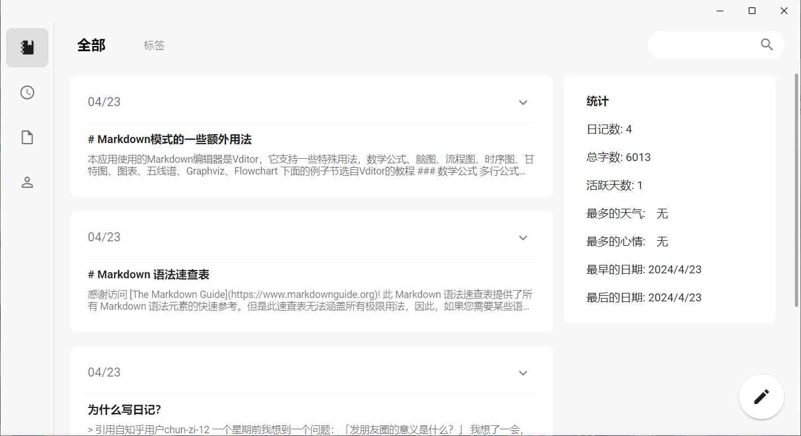
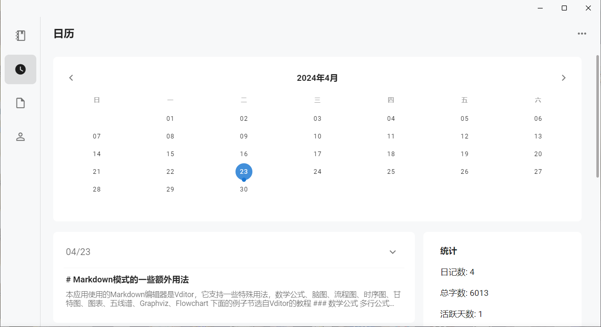
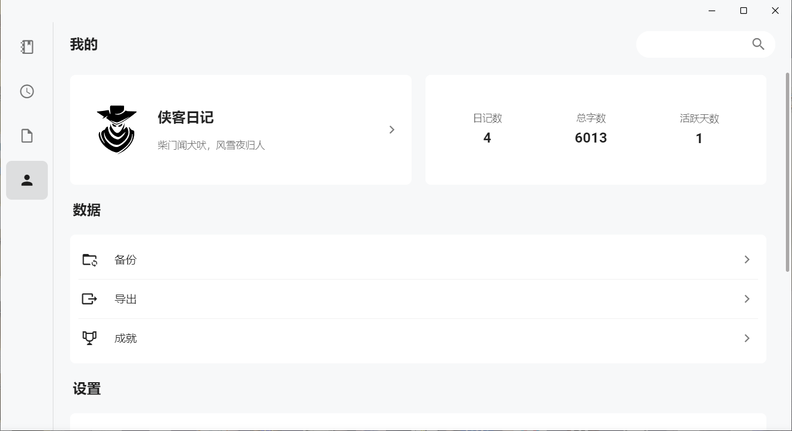
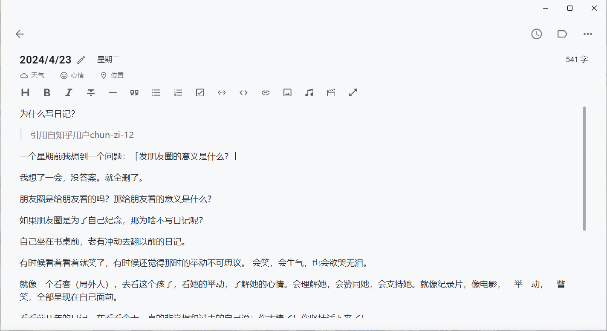
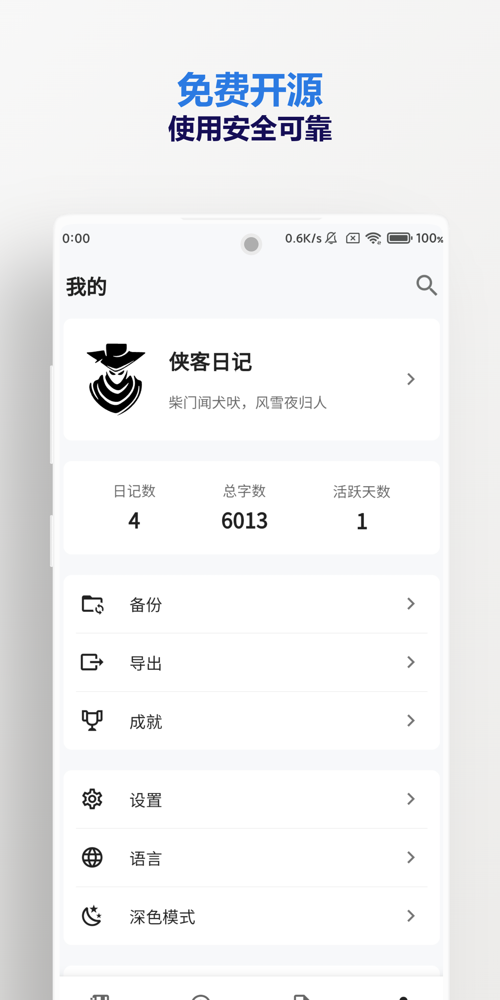

<h1 align="center">侠客日记</h1>

[English](./README.en-US.md) | 简体中文

「 侠客日记 」是一个开源、跨平台的本地日记APP。

不是所有日记都叫流水账，这本是侠客的秘籍！记录生活点滴，书写你的江湖传说。

## 🔗 在线预览
[在线演示地址（GitHub Pages）](https://yu-core.github.io/SwashbucklerDiary/)

## 🛠️ 主要技术栈
- [Blazor Hybrid](https://learn.microsoft.com/aspnet/core/blazor/hybrid/)
- [Blazor Server](https://learn.microsoft.com/aspnet/core/blazor/hosting-models#blazor-server)
- [Blazor WebAssembly](https://learn.microsoft.com/aspnet/core/blazor/hosting-models#blazor-webassembly)
- [Gir.Core](https://gircore.github.io/)
- [Masa Blazor](https://docs.masastack.com/blazor/introduction/why-masa-blazor)
- [MAUI](https://learn.microsoft.com/dotnet/maui/)
- [Serilog](https://serilog.net/)
- [SqlSugar](https://www.donet5.com/Home/Doc) 
- [Vditor](https://b3log.org/vditor/) 

## 🚀 下载渠道
- 
- [GitHub 发行版](https://github.com/Yu-Core/SwashbucklerDiary/releases)
- [123云盘](https://www.123912.com/s/eVjxjv-IfnX)
- [百度手机助手](https://shouji.baidu.com/detail/5000042660?source=appbaidu)
- [豌豆荚](https://www.wandoujia.com/apps/8369224)
- [酷安](https://www.coolapk.com/apk/937401)
- [应用宝](https://sj.qq.com/appdetail/com.yucore.swashbucklerdiary)
- [华为应用市场](https://appgallery.huawei.com/app/C107898911)

## ⬇️ [下载指南](./doc/download-guide.md)
详见 [./download-guide.md](./download-guide.md) 

## ✨ 特点
* 极简风格的UI设计
* Markdown即时渲染
* 跨平台（Android，Windows，macOS，Web，Linux）
* 多尺寸响应式的界面布局
* 所有数据存储本地，无需联网
* 隐私模式，守护你的秘密日记
* 支持图片、音频、视频
* 支持数学公式、脑图、图表、流程图、甘特图、时序图、五线谱
* 支持多种语言
* 支持深色模式
* 标签分类展示
* 天气、心情、位置
* 导出多种格式文件
* 支持文字、图片分享
* 支持webdav备份
* 同一局域网下同步传输

## 🧩 截图
<table>
    <tr>
        <td></td>
        <td></td>
    </tr>
    <tr>
        <td></td>
        <td></td>
    </tr>
 </table>

 <table>
    <tr>
        <td></td>
        <td></td>
        <td></td>
        <td></td>
    </tr>
 </table>

## 🖥 支持的平台
- Windows (Windows 11和Windows 10版本 1809 或更高版本)
- Android (Android 8.0 (API 26) 或更高版本)
- ~~iOS (iOS 14 或更高版本) (虚拟机可运行，物理机未经测试)~~
- macOS (macOS 12 或更高版本)
- Web
- Linux

## 🌏️ 支持的语言
| 代码    | 语言             | 查看                                                             |
| ------- | ---------------- | ---------------------------------------------------------------- |
| ar-EG   | 阿拉伯语（埃及）   | [查看](./src/SwashbucklerDiary.Rcl/wwwroot/i18n/ar-EG.json)      |
| de-DE   | 德语             | [查看](./src/SwashbucklerDiary.Rcl/wwwroot/i18n/de-DE.json)      |
| en-US   | 英语（美国）       | [查看](./src/SwashbucklerDiary.Rcl/wwwroot/i18n/en-US.json)      |
| es-ES   | 西班牙语（西班牙） | [查看](./src/SwashbucklerDiary.Rcl/wwwroot/i18n/es-ES.json)      |
| fr-FR   | 法语（法国）       | [查看](./src/SwashbucklerDiary.Rcl/wwwroot/i18n/fr-FR.json)      |
| ja-JP   | 日语             | [查看](./src/SwashbucklerDiary.Rcl/wwwroot/i18n/ja-JP.json)      |
| ko-KR   | 朝鲜语/韩语        | [查看](./src/SwashbucklerDiary.Rcl/wwwroot/i18n/ko-KR.json)      |
| pt-BR   | 葡萄牙语（巴西）   | [查看](./src/SwashbucklerDiary.Rcl/wwwroot/i18n/pt-BR.json)      |
| ru-RU   | 俄语              | [查看](./src/SwashbucklerDiary.Rcl/wwwroot/i18n/ru-RU.json)      |
| vi-VN   | 越南语            | [查看](./src/SwashbucklerDiary.Rcl/wwwroot/i18n/vi-VN.json)      |
| zh-CN   | 中文（简体）       | [查看](./src/SwashbucklerDiary.Rcl/wwwroot/i18n/zh-CN.json)      |
| zh-TW   | 中文（繁体）       | [查看](./src/SwashbucklerDiary.Rcl/wwwroot/i18n/zh-TW.json)      |

## ⌨️ 开发环境
[Visual Studio 2026](https://learn.microsoft.com/visualstudio/install/install-visual-studio?view=visualstudio)

- 系统要求

    - Windows 10 版本 1909 或更高版本：家庭版、专业版、教育版和企业版。

- 工作负荷

    - Web 和云
        - ASP.NET 和 Web 开发
    - 桌面应用和移动应用
        - 使用 .NET 的移动开发 / .NET Multi-platform App UI 开发
        - .NET 桌面开发
     
[Visual Studio Code](https://code.visualstudio.com/docs)

- 基础环境
 
    - [.Net 10 SDK](https://dotnet.microsoft.com/download/dotnet/10.0)
    - [libwebkitgtk-6.0-4（可选）](https://packages.ubuntu.com/jammy/libwebkitgtk-6.0-4) (For develop Linux)
    - [OpenJDK 17（可选）](https://learn.microsoft.com/zh-cn/java/openjdk/download#openjdk-17) (For develop Android)
    - [Xcode（可选）](https://developer.apple.com/xcode) (For develop macOS)

- 扩展

    - [C# Dev Kit](https://marketplace.visualstudio.com/items?itemName=ms-dotnettools.csdevkit)
    - [.NET MAUI](https://marketplace.visualstudio.com/items?itemName=ms-dotnettools.dotnet-maui)

## 🏗️ [项目结构](./directory-structure.md)
详见 [./directory-structure.md](./directory-structure.md)  

## 🙏 感谢以下开源项目
- [.NET MAUI](https://github.com/dotnet/maui)
- [ASP.NET Core](https://github.com/dotnet/aspnetcore)
- [betterSearch](https://github.com/jayZOU/betterSearch)
- [Blazored LocalStorage](https://github.com/Blazored/LocalStorage)
- [AspNetCore.Components.WebView.Gtk](https://github.com/Yu-Core/AspNetCore.Components.WebView.Gtk)
- [Brotli](https://github.com/google/brotli)
- [ClosedXML](https://github.com/ClosedXML/ClosedXML)
- [CommunityToolkit.Maui](https://github.com/CommunityToolkit/Maui)
- [dotnet-packaging](https://github.com/quamotion/dotnet-packaging)
- [EmbedIO](https://github.com/unosquare/embedio)
- [Fly Gesture Unlock](https://github.com/feiafei27/fly-gesture-unlock)
- [Gir.Core](https://github.com/gircore/gir.core)
- [Markdown Guide](https://github.com/mattcone/markdown-guide)
- [MASA.Blazor](https://github.com/BlazorComponent/MASA.Blazor)
- [MauiBlazorToolkit](https://github.com/Yu-Core/MauiBlazorToolkit)
- [maui-linux](https://github.com/MauiGtk/maui-linux)
- [Microsoft.Data.Sqlite](https://github.com/dotnet/efcore#microsoftdatasqlite)
- [panzoom](https://github.com/anvaka/panzoom)
- [Plugin.Maui.Biometric](https://github.com/FreakyAli/Plugin.Maui.Biometric)
- [Raycoon.Serilog.Sinks.SQLite](https://github.com/RAYCOON/Serilog.Sinks.SQLite)
- [Serilog](https://github.com/serilog/serilog)
- [Serilog.Enrichers.Thread](https://github.com/serilog/serilog-enrichers-thread)
- [Serilog.Extensions.Logging](https://github.com/serilog/serilog-extensions-logging)
- [Serilog.Sinks.Debug](https://github.com/serilog/serilog-sinks-debug)
- [snapdom](https://github.com/zumerlab/snapdom)
- [SQLitePCLRaw](https://github.com/ericsink/SQLitePCL.raw)
- [SqlSugar](https://github.com/DotNetNext/SqlSugar)
- [Swiper](https://github.com/nolimits4web/swiper)
- [Taglib-sharp](https://github.com/mono/taglib-sharp)
- [WebDavClient](https://github.com/skazantsev/WebDavClient)
- [wc-waterfall](https://github.com/huodoushigemi/wc-flow-layout)
- [Vditor](https://github.com/Vanessa219/vditor)

## ☕捐助
项目的发展离不开你的支持，请作者喝杯咖啡吧☕

