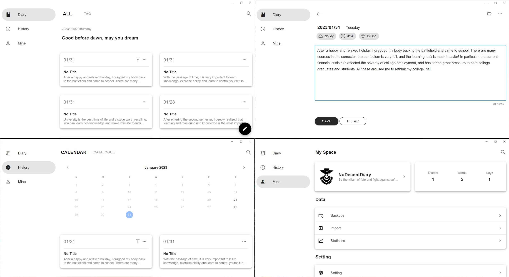
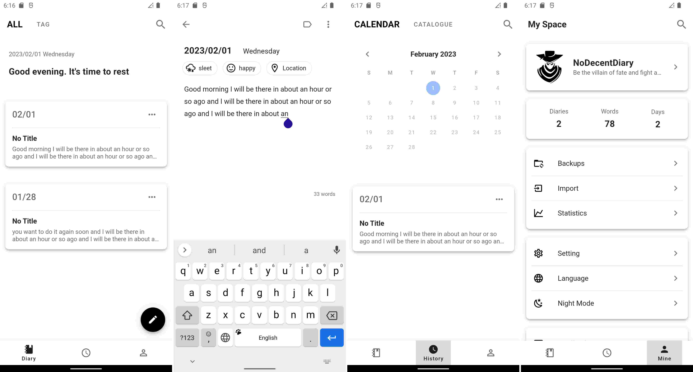

# SwashbucklerDiary(侠客日记)

[English](./README.md) | 简体中文

「SwashbucklerDiary」是一个开源跨平台的、专注于日记的应用。

## 支持的平台
- Windows (Windows 10/11)
- Android (Android 7.0以上)
- iOS (iOS 14以上)
- macOS (macOS 11以上)

## 感谢以下开源项目
- [.NET MAUI](https://github.com/dotnet/maui)
- [ASP.NET Core](https://github.com/dotnet/aspnetcore)
- [html2canvas](https://github.com/niklasvh/html2canvas)
- [MASA.Blazor](https://github.com/BlazorComponent/MASA.Blazor)
- [Serilog](https://github.com/serilog/serilog)
- [SQLite-net](https://github.com/praeclarum/sqlite-net)
- [Swiper](https://github.com/nolimits4web/swiper)
